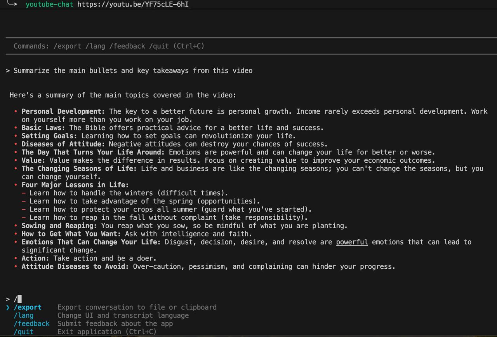

# YouTube CLI Companion

[](https://www.npmjs.com/package/@etikhonov-dev/youtube-chat)
[](https://www.npmjs.com/package/@etikhonov-dev/youtube-chat)
[](https://github.com/etikhonov-dev/youtube-chat-releases/releases)
[](LICENSE)

**Turn Any YouTube Video into an Instant AI Chat — Ask Questions and Learn Without Watching It All**



## What You Can Do

- **Chat with any YouTube video** that has transcripts/captions available
- **Ask questions** and have natural conversations about the content
- **Export conversations** to clipboard or save to a file for later reference
- Get answers with **precise timestamps** showing where information appears in the video

## Quick Start

### Standalone Binary (Recommended - No Dependencies)

**macOS / Linux / WSL:**
```bash
curl -fsSL https://raw.githubusercontent.com/etikhonov-dev/youtube-chat-releases/main/install.sh | bash
```

**Windows (PowerShell):**
```powershell
irm https://raw.githubusercontent.com/etikhonov-dev/youtube-chat-releases/main/install.ps1 | iex
```

### npm/npx

**Quick Start (No Installation):**
```bash
npx @etikhonov-dev/youtube-chat https://youtu.be/YF75cLE-6hI
```

**Or Install Globally:**
```bash
npm install -g @etikhonov-dev/youtube-chat
```

### More Options

See the [comprehensive installation guide](INSTALL.md) for:
- Manual binary downloads
- Installing from source
- Platform-specific instructions
- Future: Homebrew support

## Prerequisites

You'll need a Google API Key for Gemini API:
- Get one at: https://aistudio.google.com/apikey

**Set up your key:**

macOS/Linux/WSL:
```bash
export GOOGLE_API_KEY='your_api_key_here'
```

Windows (PowerShell):
```powershell
[Environment]::SetEnvironmentVariable('GOOGLE_API_KEY', 'your-key-here', 'User')
```

## Usage

Start chatting with any YouTube video:

```bash
youtube-chat https://youtu.be/YF75cLE-6hI
```

### Available Commands

Type `/` to see all available commands:

- **`/export`** - Export the conversation to file or clipboard
- **`/lang`** - Change UI and transcript language
- **`/feedback`** - Submit feedback
- **`/quit`** - Exit (or press Ctrl+C)

### Tips for Best Results

- Videos must have captions/transcripts available
- Be specific with your questions
- Follow up for more details or clarification
- Export conversations you want to keep

## Downloads

Download pre-built binaries from [Releases](https://github.com/etikhonov-dev/youtube-chat-releases/releases/latest):

- **macOS**: `youtube-chat-macos-x64` | `youtube-chat-macos-arm64`
- **Linux**: `youtube-chat-linux-x64` | `youtube-chat-linux-arm64`
- **Windows**: `youtube-chat-win-x64.exe`

## Links

- **npm Package**: https://www.npmjs.com/package/@etikhonov-dev/youtube-chat
- **Installation Guide**: [INSTALL.md](INSTALL.md)
- **Latest Release**: [View Releases](https://github.com/etikhonov-dev/youtube-chat-releases/releases)

## Troubleshooting

**"Failed to load transcript"**
- Video may not have captions enabled
- Try a different video with subtitles

**API Key errors**
- Ensure GOOGLE_API_KEY is set correctly
- Verify your API key at https://aistudio.google.com/apikey

## License

This project is licensed for **non-commercial use only**.

Copyright (c) 2025

See [LICENSE](LICENSE) for full details.